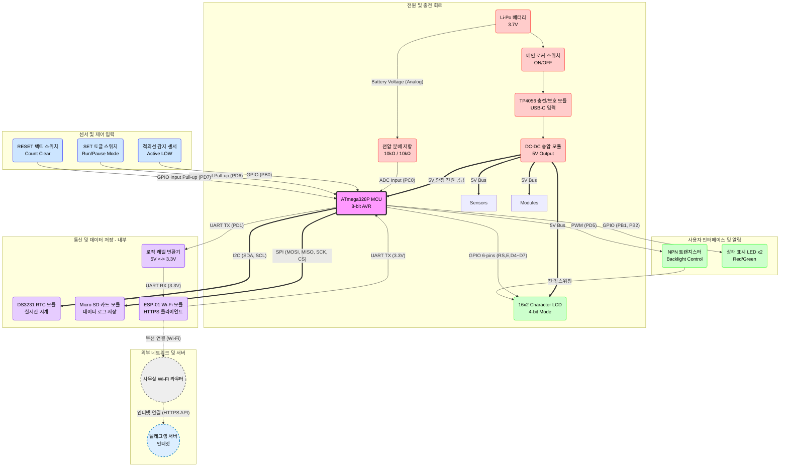

## 출입감지 시스템

### 프로젝트 개요
#### 개요
- **프로젝트명**: ATmega328P 기반 출입감지 시스템
- **배경**: 사무실 출입문 잠금장치는 디지털 도어락이 아닌 구형 열쇠 방식으로, 출입 시마다 번거러움 발생. 상시 모니터링이 가능한 보조 보안 장치 도입이 시급

#### 목적
- **임베디드 개발 전체 주기 경험**: 펌웨어 개발부터 제품화까지 프로세스 체득
- **Bare-metal 프로그래밍**: Arduino 라이브러리를 탈피하고, Datasheet를 분석하여 레지스터(Register) 직접 제어를 통한 하드웨어 이해도 함양
- **실무 통신 프로토콜 활용**: SPI, I2C, UART 등 다양한 인터페이스를 활용하여 센서 및 통신 모듈 제어 능력 배양

#### 개발환경
- MCU: ATmega328P
- IDE: Microchip Studio (GCC C Executable)
- Language: Embedded C

### 프로젝트 요구사항
#### 기능적 요구사항
- **실시간 출입 감지**: 적외선 센서를 통해 외부인 접근 즉시 감지 (Falling/Rising Edge Detection)
- **데이터 로깅**: 감지된 모든 이벤트의 날짜와 시간을 SD 카드에 .csv 형태로 영구 저장
- **원격 알림**: 침입 감지 시 Wi-Fi 모듈(ESP8266)을 통해 관리자의 스마트폰(Telegram App)으로 즉시 알림 전송.
- **상태 표시**: LCD를 통해 현재 방문자 수, 배터리 잔량, 현재 시간, 시스템 상태(Run/Pause) 등 시각화
- **사용자 제어**
  - SET(Toggle): 보안 모드 활성화/일시정지 제어.
  - RESET(Tact): 누적 카운트 및 시스템 상태 초기화

#### 비기능적 요구사항
- **독립형 전원 설계**: 리튬 폴리머 배터리를 탑재하여 무선 동작 구현
- **제품화(Enclosure)**: 회로 및 배터리가 노출되지 않도록 케이스 제작 및 스위치/충전 포트 외부 마운트

### 하드웨어 구성

### 역할
#### 박관호
- GPIO, Timer/Counter, External Interrupt 레지스터 설정 및 제어
- UART 통신 드라이버 구현 (ESP8266 제어 및 디버깅)
- ADC를 이용한 배터리 전압 측정 알고리즘 구현

#### 추현수
- I2C 프로토콜 기반 DS3231(RTC) 제어 라이브러리 작성
- SPI 통신 기반 SD카드 파일 시스템(FAT) 인터페이스 연동
- LCD 디스플레이 제어 구현
- 회로 납땜 및 배선 정리

### 프로젝트 아키텍처

